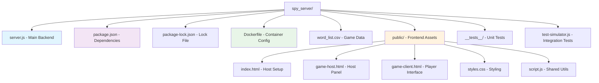
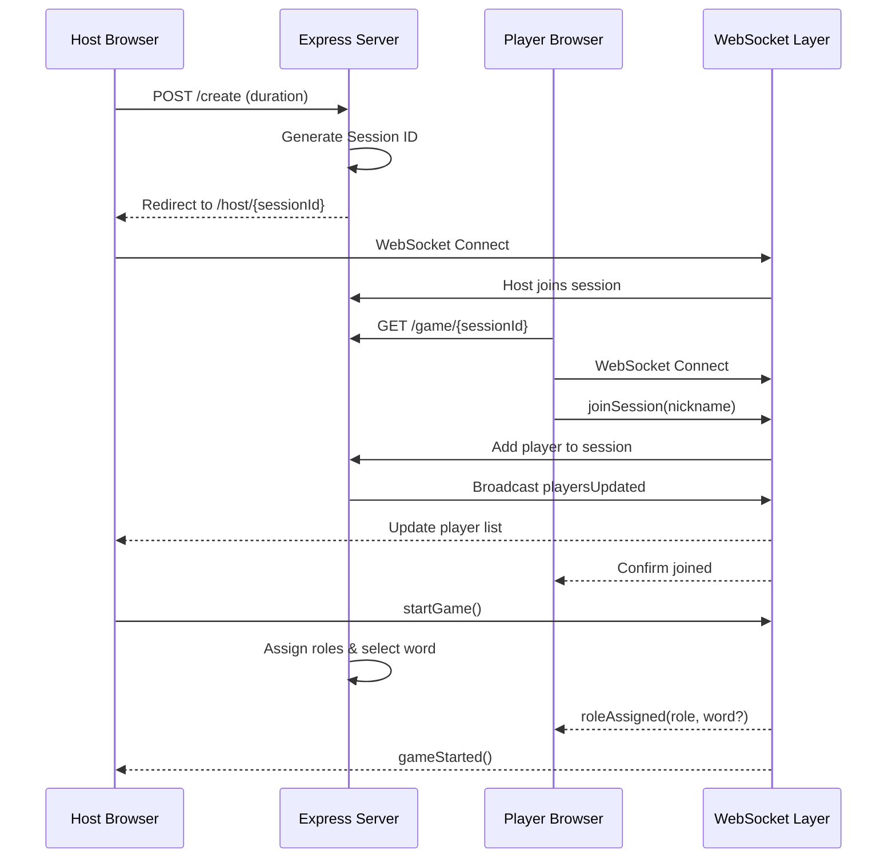
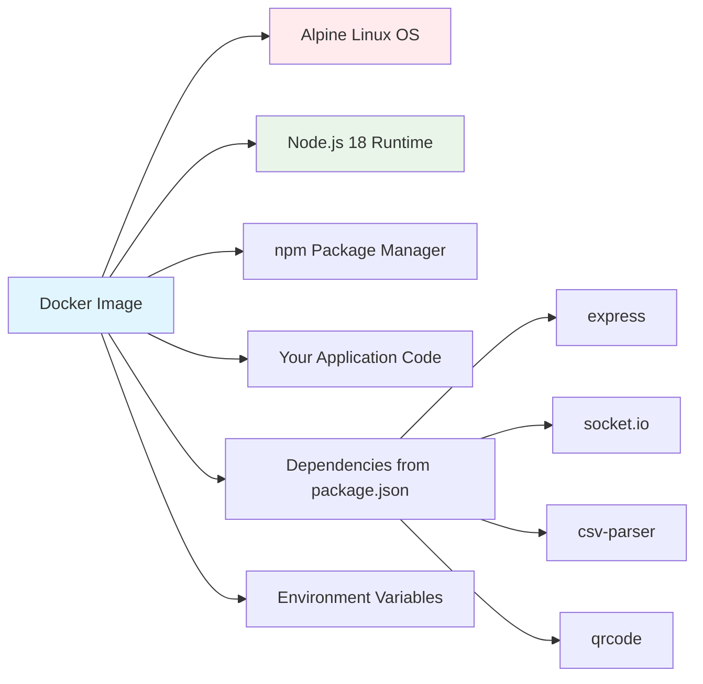
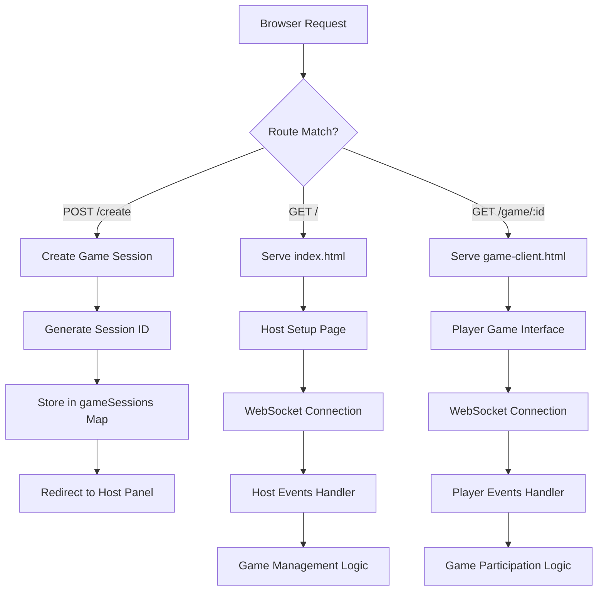
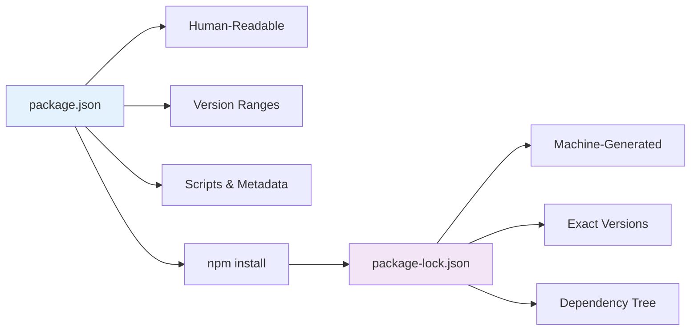
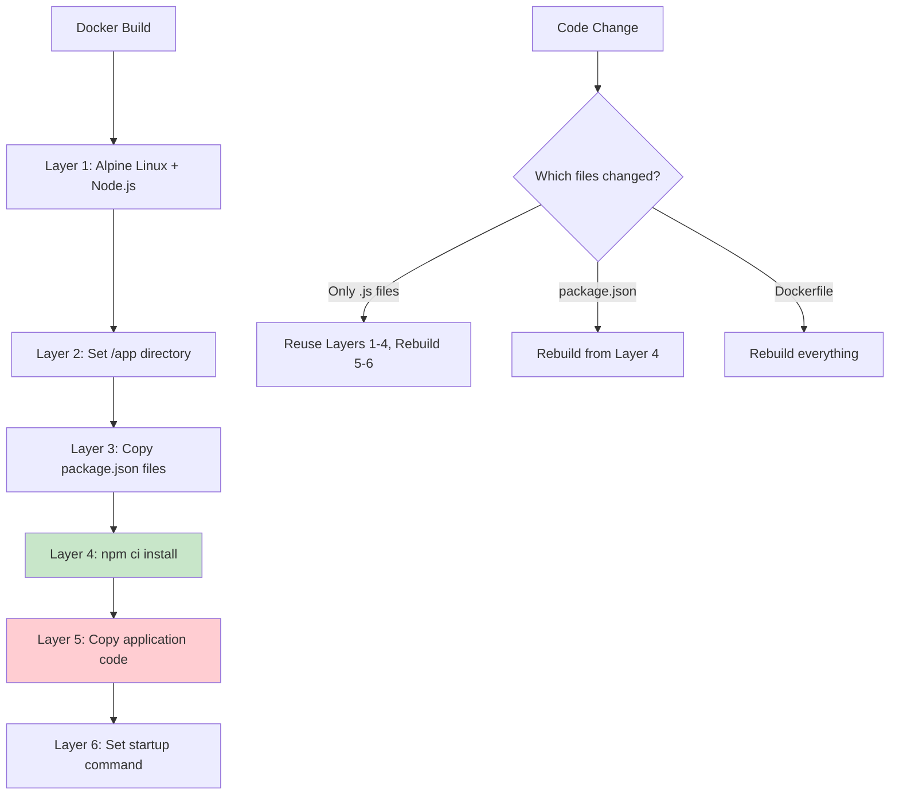
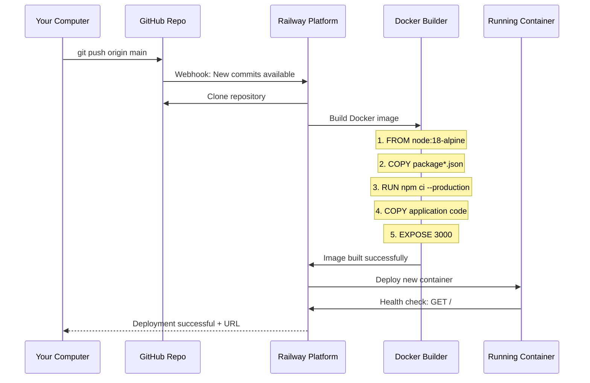

# 🕵️ Spy Word Game

A multiplayer web-based game combining elements of Spyfall and Kahoot, where players try to identify the spies among them while spies try to blend in without knowing the secret word.

## 🎮 Game Overview

**Spy Word Game** is a real-time multiplayer social deduction game where:
- **Civilians** receive a secret word and must discuss it without revealing it to spies
- **Spies** don't know the word and must try to blend in by participating in the discussion
- **Host** manages the game session and controls timing
- **Everyone** tries to figure out who the spies are before time runs out

### Game Flow
1. **Setup**: Host creates a game session with custom duration (5-60 minutes)
2. **Lobby**: Players join via URL/QR code and wait for game start
3. **Assignment**: Spies are randomly selected (1 spy per 3 players minimum)
4. **Discussion**: Players discuss the secret word while spies try to blend in
5. **Revelation**: When time expires, spies are revealed

## 🚀 Quick Start

### Installation

```bash
# Clone or extract the project
cd spy_server

# Install dependencies
npm install

# Start the server
npm start
```

The server will start on `http://localhost:3000`

### First Game

1. **Open your browser** and go to `http://localhost:3000`
2. **Set game duration** (5-60 minutes) and click "Start Game Session"
3. **Share the join URL** with players or show them the QR code
4. **Wait for players** to join (minimum 4 required)
5. **Start the game** when ready
6. **Begin discussion** when the timer starts
7. **Reveal spies** when time expires

## � Code Tutorial & Architecture Guide

### 🎓 For Developers New to JavaScript

This section provides a comprehensive guide to understanding the codebase structure, key concepts, and deployment mechanics.

#### 📁 Project Structure Overview



#### 🏗️ Application Architecture



#### 🔧 Key Files Explained

##### 📦 `package.json` - Project Configuration
```javascript
{
  "name": "spy-word-game",           // Project identifier
  "version": "1.0.0",               // Semantic versioning
  "main": "server.js",              // Entry point for Node.js
  "scripts": {
    "start": "node server.js",      // Production command
    "dev": "nodemon server.js",     // Development with auto-reload
    "test": "jest"                  // Run unit tests
  },
  "dependencies": {
    "express": "^4.18.2",          // Web server framework
    "socket.io": "^4.7.2",         // Real-time WebSocket communication
    "csv-parser": "^3.0.0",        // Parse word list CSV
    "qrcode": "^1.5.3"             // Generate QR codes
  },
  "engines": {
    "node": ">=16.0.0"              // Minimum Node.js version
  }
}
```

**Key Concepts:**
- **Dependencies**: External libraries your code needs
- **Scripts**: Commands you can run with `npm run <script-name>`
- **Engines**: Specifies minimum Node.js version for deployment
- **Main**: Entry file that starts your application

##### 🔒 `package-lock.json` - Dependency Lock File
```json
{
  "lockfileVersion": 3,
  "requires": true,
  "packages": {
    "": {
      "dependencies": {
        "express": "4.18.2",        // Exact version installed
        "socket.io": "4.7.2"       // Prevents version conflicts
      }
    },
    "node_modules/express": {
      "version": "4.18.2",         // Specific version locked
      "resolved": "https://registry.npmjs.org/express/-/express-4.18.2.tgz",
      "integrity": "sha512-5/PsL6iGPdfQ/lKM1UuielYgv3BUoJfz1aUwU9vHZ+J7gyvwdQXFEBIEIaxeGf0GIcreATNyBExtalisDbuMqQ=="
    }
  }
}
```

**Why This Matters:**
- **Reproducible Builds**: Ensures everyone gets exactly the same dependency versions
- **Security**: Prevents malicious package updates from breaking your app
- **Deployment**: Cloud platforms use this to install identical dependencies

##### 🐳 `Dockerfile` - Container Configuration
```dockerfile
# Use official Node.js runtime as base image
FROM node:18-alpine

# Set working directory inside container
WORKDIR /app

# Copy package files first (for better Docker layer caching)
COPY package*.json ./

# Install dependencies inside container
RUN npm ci --only=production

# Copy application code
COPY . .

# Expose port 3000 to outside world
EXPOSE 3000

# Command to run when container starts
CMD ["npm", "start"]
```

**Container Concept:**
- **Image**: Blueprint containing your app + Node.js + dependencies
- **Container**: Running instance of your image
- **Layers**: Docker builds in layers for efficiency
- **Isolation**: Container runs independently of host system

##### 🎮 Core Application Files

**`server.js` - Backend Heart**
```javascript
// Import required modules
const express = require('express');     // Web framework
const http = require('http');          // HTTP server
const socketIo = require('socket.io'); // WebSocket library
const path = require('path');          // File path utilities

// Create Express application
const app = express();
const server = http.createServer(app);  // HTTP server instance
const io = socketIo(server);           // WebSocket server

// In-memory data structures
const gameSessions = new Map();        // sessionId -> GameSession object
const words = [];                      // Array of game words

// GameSession class definition
class GameSession {
    constructor(hostSocketId, duration) {
        this.id = generateSessionId();     // Unique 6-character ID
        this.hostSocketId = hostSocketId;  // Host's WebSocket connection
        this.players = new Map();          // nickname -> player data
        this.gameState = 'lobby';          // 'lobby' | 'playing' | 'ended'
        this.duration = duration * 60000;  // Convert minutes to milliseconds
        this.word = null;                  // Secret word for current round
        this.spies = new Set();            // Set of spy nicknames
    }
}
```

**Key JavaScript Concepts:**
- **`require()`**: Import modules (similar to `import` in other languages)
- **`const`/`let`**: Variable declarations (`const` = immutable, `let` = mutable)
- **`Map()` vs `Set()`**: Map = key-value pairs, Set = unique values
- **Classes**: ES6 class syntax similar to other OOP languages
- **Arrow functions**: `() => {}` shorthand for anonymous functions

**WebSocket Event Handling**
```javascript
// When a client connects to WebSocket
io.on('connection', (socket) => {
    console.log('New connection:', socket.id);
    
    // Listen for custom events from client
    socket.on('joinSession', (data) => {
        const { sessionId, nickname } = data;  // Destructuring assignment
        
        // Validation
        if (!sessionId || !nickname) {
            socket.emit('error', 'Missing required data');
            return;
        }
        
        // Business logic
        const session = gameSessions.get(sessionId);
        if (!session) {
            socket.emit('error', 'Session not found');
            return;
        }
        
        // Add player to session
        session.players.set(nickname, {
            socketId: socket.id,
            nickname: nickname,
            role: null  // Will be assigned when game starts
        });
        
        // Join WebSocket room for session-specific broadcasts
        socket.join(sessionId);
        
        // Send confirmation to player
        socket.emit('joinedSession', { nickname });
        
        // Notify all players in session about updated player list
        io.to(sessionId).emit('playersUpdated', {
            players: Array.from(session.players.keys()),
            count: session.players.size
        });
    });
});
```

**Frontend Structure (`game-client.html`)**
```html
<!DOCTYPE html>
<html>
<head>
    <meta name="viewport" content="width=device-width, initial-scale=1.0">
    <link rel="stylesheet" href="/styles.css">
</head>
<body>
    <!-- Game phases as separate divs -->
    <div id="join-phase">
        <form id="joinForm">
            <input type="text" id="nickname" placeholder="Your nickname">
            <button type="submit">Join Game</button>
        </form>
    </div>
    
    <div id="lobby-phase" class="hidden">
        <!-- Waiting room UI -->
    </div>
    
    <div id="game-phase" class="hidden">
        <!-- Active game UI -->
    </div>
    
    <!-- Include Socket.io client library -->
    <script src="/socket.io/socket.io.js"></script>
    <script>
        let socket;
        let sessionId;
        let playerNickname;
        
        // Initialize WebSocket connection
        function initializeSocket() {
            socket = io({
                transports: ['websocket', 'polling'],  // Connection methods
                timeout: 20000,                        // 20 second timeout
                reconnection: true,                    // Auto-reconnect
                reconnectionAttempts: 5                // Try 5 times
            });
            
            // Event listeners for server messages
            socket.on('connect', () => {
                console.log('Connected to server');
                sessionId = window.location.pathname.split('/')[2];  // Extract from URL
                hideConnectionError();
            });
            
            socket.on('joinedSession', (data) => {
                playerNickname = data.nickname;
                showLobbyPhase();  // Switch UI phase
            });
            
            socket.on('roleAssigned', (data) => {
                if (data.role === 'spy') {
                    showSpyRole();
                } else {
                    showCivilianRole(data.word);  // Civilians get the secret word
                }
            });
        }
        
        // Form submission handler
        document.getElementById('joinForm').addEventListener('submit', (e) => {
            e.preventDefault();  // Prevent page reload
            
            const nickname = document.getElementById('nickname').value.trim();
            
            if (!nickname) {
                showError('Please enter a nickname');
                return;
            }
            
            // Send join request to server
            socket.emit('joinSession', { sessionId, nickname });
        });
        
        // Initialize when page loads
        initializeSocket();
    </script>
</body>
</html>
```

#### 🚀 Docker Deep Dive

##### What Docker Contains


##### Docker Build Process
```bash
# 1. Docker reads Dockerfile line by line
# 2. Each instruction creates a new layer

FROM node:18-alpine        # Layer 1: Base OS + Node.js
WORKDIR /app              # Layer 2: Set working directory
COPY package*.json ./     # Layer 3: Copy package files
RUN npm ci               # Layer 4: Install dependencies
COPY . .                 # Layer 5: Copy application code
EXPOSE 3000              # Layer 6: Document port usage
CMD ["npm", "start"]     # Layer 7: Set startup command
```

##### Docker vs Direct Installation
| Aspect | Direct Install | Docker Container |
|--------|----------------|------------------|
| **Dependencies** | Install Node.js on host | Node.js included in image |
| **Isolation** | Shares host environment | Completely isolated |
| **Portability** | "Works on my machine" | Works anywhere Docker runs |
| **Deployment** | Manual setup on server | Single image deployment |
| **Scaling** | Manual process management | Container orchestration |

##### Railway Docker Deployment
```yaml
# Railway automatically detects and builds Dockerfile
# Equivalent to running:
docker build -t spy-game .
docker run -p $PORT:3000 spy-game

# Railway provides:
# - Automatic port binding ($PORT environment variable)
# - Health checks on your application
# - Load balancing for multiple instances
# - Automatic HTTPS certificates
# - Environment variable injection
```

#### 🔍 Code Reading Guide

##### Following Request Flow


##### Key JavaScript Patterns to Understand

**1. Event-Driven Architecture**
```javascript
// Server listens for events from clients
socket.on('eventName', (data) => {
    // Handle event
    processEvent(data);
    
    // Emit response
    socket.emit('responseEvent', result);
});

// Client listens for events from server
socket.on('serverEvent', (data) => {
    // Update UI based on server data
    updateInterface(data);
});
```

**2. Asynchronous Operations**
```javascript
// Timers and delays
setTimeout(() => {
    console.log('This runs after 5 seconds');
}, 5000);

// Intervals
const timer = setInterval(() => {
    console.log('This runs every second');
}, 1000);

// Stop interval
clearInterval(timer);
```

**3. DOM Manipulation**
```javascript
// Get elements
const element = document.getElementById('myId');
const elements = document.querySelectorAll('.myClass');

// Modify content
element.textContent = 'New text';
element.innerHTML = '<b>Bold text</b>';

// Show/hide elements
element.classList.add('hidden');
element.classList.remove('hidden');
element.classList.toggle('active');
```

**4. Data Structures**
```javascript
// Arrays
const players = ['Alice', 'Bob', 'Charlie'];
players.push('David');          // Add to end
players.includes('Alice');      // Check if exists

// Objects (like dictionaries/maps)
const player = {
    name: 'Alice',
    role: 'spy',
    score: 100
};

// Maps (better for dynamic keys)
const sessions = new Map();
sessions.set('ABC123', gameSession);
sessions.get('ABC123');
sessions.has('ABC123');
sessions.delete('ABC123');

// Sets (unique values only)
const spies = new Set();
spies.add('Alice');
spies.add('Bob');
spies.size;  // 2
```

#### 🛠️ Development Workflow

##### Local Development Setup
```bash
# 1. Clone repository
git clone <repository-url>
cd spy_server

# 2. Install dependencies (reads package.json)
npm install

# 3. Development mode (auto-restarts on file changes)
npm run dev

# 4. Production mode
npm start

# 5. Run tests
npm test
```

##### File Watching and Auto-Reload
```javascript
// package.json includes nodemon for development
{
  "scripts": {
    "dev": "nodemon server.js",      // Watches files, restarts on changes
    "start": "node server.js"        // Production: no file watching
  },
  "devDependencies": {
    "nodemon": "^2.0.22"            // Development-only dependency
  }
}
```

##### Environment Variables
```javascript
// server.js reads environment variables
const PORT = process.env.PORT || 3000;        // Railway sets PORT automatically
const HOST = process.env.HOST || 'localhost'; // Override for different hosts

// In production (Railway/Docker):
// PORT=45678 (set by platform)
// NODE_ENV=production (optimizations)

// In development:
// PORT=3000 (your local setting)
// NODE_ENV=development (debug info)
```

#### 📊 Performance & Scaling Considerations

##### Memory Usage
```javascript
// In-memory storage (current approach)
const gameSessions = new Map();  // Stores all active games in RAM

// Pros:
// - Fast access (no database queries)
// - Simple implementation
// - No external dependencies

// Cons:
// - Data lost on server restart
// - Limited by available RAM
// - Can't scale horizontally easily

// For larger scale, consider:
// - Redis for session storage
// - Database for persistent data
// - Horizontal scaling with load balancers
```

##### Connection Management
```javascript
// Socket.io handles connection lifecycle
io.on('connection', (socket) => {
    // Client connected
    
    socket.on('disconnect', (reason) => {
        // Client disconnected - cleanup required
        removePlayerFromAllSessions(socket.id);
    });
});
```

#### 🎯 Next Steps for Learning

1. **Start Small**: Modify existing functions before adding new features
2. **Use Browser DevTools**: 
   - Console tab for JavaScript errors
   - Network tab to see WebSocket messages
   - Elements tab to inspect DOM changes
3. **Add Logging**: Use `console.log()` liberally to understand flow
4. **Read Documentation**:
   - [Express.js Guide](https://expressjs.com/en/guide/routing.html)
   - [Socket.io Documentation](https://socket.io/docs/)
   - [MDN JavaScript Reference](https://developer.mozilla.org/en-US/docs/Web/JavaScript)

## 📋 Features
- **Real-time multiplayer** via WebSocket connections
- **Secure randomization** using Node.js crypto module
- **Scalable architecture** supports up to 100 players per session
- **Cross-platform compatibility** (desktop and mobile browsers)

### 🎨 User Interface
- **Responsive design** optimized for mobile and desktop
- **Visual timer** with color-coded warnings
- **Role assignment** with clear spy/civilian indicators
- **Game status tracking** throughout all phases

### 🔊 Audio & Notifications
- **Web Audio API** for game end alarms
- **Browser notifications** to wake inactive tabs
- **Visual alerts** with flashing animations
- **Mobile-friendly** touch interactions

### 🛠 Host Controls
- **Session management** (create, start, abort, close)
- **Lobby controls** (extend time, kick players)
- **Game monitoring** (player count, timer, spy reveal)
- **Round management** (new rounds with different words/spies)

### 📱 Player Features
- **Simple joining** via URL or QR code
- **Nickname validation** prevents duplicates
- **Role display** shows spy status and word (for civilians)
- **Real-time updates** for all game state changes
- **Graceful disconnection** handling

## ⚙️ Configuration Files Deep Dive

### 📋 Essential Files Breakdown

#### `package.json` vs `package-lock.json`


**`package.json` - The Blueprint**
```json
{
  "dependencies": {
    "express": "^4.18.2"    // ^ means "4.18.2 or newer minor version"
  },
  "scripts": {
    "start": "node server.js",     // What Railway runs in production
    "dev": "nodemon server.js",    // Development with auto-restart
    "test": "jest __tests__/"      // Run unit tests
  }
}
```

**`package-lock.json` - The Exact Recipe**
```json
{
  "dependencies": {
    "express": {
      "version": "4.18.2",              // Exact version installed
      "resolved": "https://...",        // Where it was downloaded from
      "integrity": "sha512-...",        // Security checksum
      "requires": {                     // What express needs
        "accepts": "~1.3.8",
        "array-flatten": "1.1.1"
      }
    }
  }
}
```

#### Docker Configuration Files

**`Dockerfile` - Container Recipe**
```dockerfile
# Stage 1: Base Environment
FROM node:18-alpine AS base
# Alpine = Minimal Linux (5MB vs 1GB+ full Linux)
# node:18 = Specific Node.js version for consistency

# Stage 2: Working Environment Setup
WORKDIR /app
# Everything happens in /app directory inside container

# Stage 3: Dependency Installation (Cached Layer)
COPY package*.json ./
# Copy package files FIRST for Docker layer caching
# If only code changes, this layer stays cached
RUN npm ci --only=production --silent
# npm ci = faster, deterministic installs for production
# --only=production = skip devDependencies (testing tools, etc.)

# Stage 4: Application Code
COPY . .
# Copy all remaining files

# Stage 5: Runtime Configuration
EXPOSE 3000
# Document which port the app uses (for Railway/cloud platforms)
CMD ["npm", "start"]
# Command to run when container starts
```

**`.dockerignore` - What NOT to Copy**
```bash
node_modules/          # Don't copy, will be installed fresh
.git/                  # Version control not needed in container
__tests__/             # Tests not needed in production
*.log                  # Log files
.env.local             # Local environment files
README.md              # Documentation
```

#### Environment-Specific Files

**Development Environment**
```bash
# .env.development (if you create one)
PORT=3000
NODE_ENV=development
DEBUG=socket.io*       # Enable detailed Socket.io logging
```

**Production Environment (Railway automatically sets)**
```bash
PORT=12345             # Railway assigns random port
NODE_ENV=production    # Enables optimizations
RAILWAY_PROJECT_ID=... # Platform-specific variables
```

### 🐳 Docker Layer Optimization



**Why This Matters:**
- **Faster Builds**: Unchanged layers are reused
- **Efficient Storage**: Common layers shared between images
- **Quick Deployments**: Only changed layers uploaded to cloud

### 📦 Dependency Management Strategy

#### Production Dependencies (Required at Runtime)
```json
{
  "dependencies": {
    "express": "^4.18.2",        // Web server - CRITICAL
    "socket.io": "^4.7.2",       // Real-time communication - CRITICAL
    "csv-parser": "^3.0.0",      // Parse word list - CRITICAL
    "qrcode": "^1.5.3"           // Generate join codes - NICE TO HAVE
  }
}
```

#### Development Dependencies (Not Deployed)
```json
{
  "devDependencies": {
    "nodemon": "^2.0.22",        // Auto-restart during development
    "jest": "^29.0.0"            // Testing framework
  }
}
```

#### Security & Version Management
```bash
# Check for vulnerable dependencies
npm audit

# Fix automatically fixable issues
npm audit fix

# Update dependencies to latest compatible versions
npm update

# Check what's outdated
npm outdated
```

### 🚀 Railway Deployment Mechanics

#### How Railway Builds Your App


#### Railway Environment Injection
```javascript
// Your code reads Railway's environment variables
const port = process.env.PORT || 3000;           // Railway sets this
const host = process.env.RAILWAY_PUBLIC_DOMAIN;  // Your app's URL

server.listen(port, () => {
    console.log(`Server running on port ${port}`);
    if (host) {
        console.log(`Public URL: https://${host}`);
    }
});
```

#### Railway Configuration Files (Auto-Generated)

**`railway.toml` (Optional - for advanced config)**
```toml
[build]
builder = "dockerfile"           # Use your Dockerfile
buildCommand = "echo 'Building with Docker'"

[deploy]
healthcheckPath = "/"           # Railway pings this URL to verify app is running
healthcheckTimeout = 300        # Wait 5 minutes for app to start
restartPolicyType = "always"    # Restart if crashes

[environments.production]
variables = { NODE_ENV = "production" }
```

### 🔧 Common Configuration Issues & Solutions

#### Problem: "Module not found" in Production
```bash
# Wrong: Installing as devDependency
npm install --save-dev express

# Right: Installing as production dependency
npm install --save express
```

#### Problem: Different Behavior Local vs Production
```javascript
// Wrong: Hardcoded localhost
const socket = io('http://localhost:3000');

// Right: Dynamic host detection
const socket = io(); // Automatically uses current domain
```

#### Problem: Environment Variables Not Working
```javascript
// Wrong: Expecting .env file in production
require('dotenv').config();

// Right: Cloud platforms inject environment variables directly
const port = process.env.PORT || 3000; // Fallback for local dev
```

#### Problem: Port Conflicts in Docker
```dockerfile
# Wrong: Hardcoded port
EXPOSE 3000
CMD ["node", "server.js", "--port=3000"]

# Right: Use environment variable
EXPOSE $PORT
# Let your app code handle process.env.PORT
```

### 📊 Performance Monitoring

#### What to Monitor in Production
```javascript
// Add basic metrics to your app
const startTime = Date.now();
let activeConnections = 0;
let totalConnections = 0;

io.on('connection', (socket) => {
    activeConnections++;
    totalConnections++;
    
    socket.on('disconnect', () => {
        activeConnections--;
    });
});

// Health check endpoint for Railway
app.get('/health', (req, res) => {
    res.json({
        status: 'healthy',
        uptime: Date.now() - startTime,
        activeConnections,
        totalConnections,
        memory: process.memoryUsage(),
        version: require('./package.json').version
    });
});
```

## 🏗 Technical Architecture

### Backend (Node.js)
- **Express.js** HTTP server
- **Socket.io** WebSocket communication
- **CSV parsing** for word list management
- **QR code generation** for easy mobile joining
- **In-memory session storage** (no database required)

### Frontend (Vanilla JS)
- **Responsive HTML5/CSS3** interface
- **Socket.io client** for real-time communication
- **Web Audio API** for sound effects
- **Notification API** for background alerts
- **Local storage** for user preferences

### File Structure
```
spy_server/
├── server.js              # Main server application
├── package.json           # Dependencies and scripts
├── word_list.csv          # Game words (Persian/English)
├── public/                # Client-side assets
│   ├── index.html         # Host setup page
│   ├── game-host.html     # Host control panel
│   ├── game-client.html   # Player game interface
│   ├── test.html          # Testing utilities
│   ├── styles.css         # Responsive styling
│   └── script.js          # Shared utilities
├── __tests__/             # Jest unit tests
├── test-simulator.js      # Integration test simulator
└── README.md              # This file
```

## 🧪 Testing

### Automated Testing

```bash
# Run unit tests
npm test

# Run integration tests with simulator
npm run test:integration

# Interactive test mode
node test-simulator.js
```

### Manual Testing

1. **Single Device Testing**
   ```bash
   # Start server
   npm start
   
   # Open multiple browser tabs/windows
   # Navigate to http://localhost:3000
   # Create game in one tab, join from others
   ```

2. **Multi-Device Testing**
   ```bash
   # Use ngrok for public URL
   npx ngrok http 3000
   
   # Share the ngrok URL with other devices
   # Test mobile browser compatibility
   ```

3. **Test Page**
   - Visit `http://localhost:3000/test`
   - Use built-in testing tools
   - Simulate multiple players
   - Test audio/notification features

### Testing Scenarios

#### ✅ Basic Flow Test
1. Create game session (5-60 min duration)
2. Join with 4+ players
3. Start game and assign roles
4. Run timer and end game
5. Reveal spies and start new round

#### ✅ Edge Cases Test
- Less than 4 players (should block start)
- Duplicate nicknames (should prevent join)
- Host disconnection (should abort game)
- Invalid game duration (should show error)
- Network interruption (should handle gracefully)

#### ✅ Load Testing
- 10+ simultaneous players
- Multiple concurrent game sessions
- Rapid join/leave scenarios
- Extended game durations

## 🔧 Configuration

### Game Settings
```javascript
// In server.js - modify these constants
const MIN_PLAYERS = 4;           // Minimum players to start
const MAX_PLAYERS = 100;         // Maximum players per session
const LOBBY_DURATION = 90;       // Lobby time in seconds
const MIN_GAME_DURATION = 5;     // Minimum game minutes
const MAX_GAME_DURATION = 60;    // Maximum game minutes
```

### Word Management
```bash
# Add words to CSV file
echo "newword," >> word_list.csv

# Or use the web interface at /
# Click "Add Custom Words" section
```

### Environment Variables
```bash
# Optional: Set custom port
export PORT=8080

# Optional: Set custom hostname
export HOST=0.0.0.0
```

## 🌐 Deployment

### Local Development
```bash
npm install
npm run dev  # Uses nodemon for auto-restart
```

### Production Deployment (Always Online)

#### 🚀 Railway (Recommended - Free & Easy)
Railway offers excellent Node.js support with free tier perfect for this game.

```bash
# Install Railway CLI
npm install -g @railway/cli

# Login to Railway
railway login

# Deploy from your current directory
railway up

# Get your live URL
railway domain
```

**Why Railway?**
- ✅ Free tier with 500 hours/month (enough for always-on)
- ✅ Automatic deployments from GitHub
- ✅ Built-in environment variables
- ✅ WebSocket support
- ✅ Custom domains

#### 🌐 Render (Great Alternative - Free Tier)
```bash
# 1. Push your code to GitHub (you've already done this!)
# 2. Go to https://render.com
# 3. Connect your GitHub repository
# 4. Choose "Web Service"
# 5. Configure:
#    - Build Command: npm install
#    - Start Command: npm start
#    - Port: 3000
```

**Why Render?**
- ✅ Free tier (with some limitations)
- ✅ Automatic deployments from GitHub
- ✅ Free SSL certificates
- ✅ Easy setup via web interface

#### ☁️ Heroku (Classic Choice)
```bash
# Install Heroku CLI from https://devcenter.heroku.com/articles/heroku-cli

# Login to Heroku
heroku login

# Create Heroku app
heroku create your-spy-word-game

# Deploy
git push heroku master

# Open your live app
heroku open
```

**Note:** Heroku removed their free tier, so this requires a paid plan (~$5-7/month).

#### ⚡ Vercel (Serverless)
```bash
# Install Vercel CLI
npm i -g vercel

# Deploy (follow prompts)
vercel --prod

# Your app will be live at https://your-project.vercel.app
```

**Note:** Vercel is serverless, which works great for the frontend but may have limitations with persistent WebSocket connections.

#### 🔥 Firebase Hosting + Cloud Functions
```bash
# Install Firebase CLI
npm install -g firebase-tools

# Login to Firebase
firebase login

# Initialize Firebase project
firebase init

# Deploy
firebase deploy
```

#### 🐳 DigitalOcean App Platform
1. Go to [DigitalOcean App Platform](https://cloud.digitalocean.com/apps)
2. Connect your GitHub repository
3. Configure build settings:
   - Build Command: `npm install`
   - Run Command: `npm start`
4. Deploy with one click

#### 📋 Quick Comparison

| Platform | Free Tier | Always On | WebSockets | Setup Difficulty |
|----------|-----------|-----------|------------|------------------|
| **Railway** | ✅ 500hrs/month | ✅ Yes | ✅ Yes | ⭐⭐ Easy |
| **Render** | ✅ Limited | ⚠️ Sleeps | ✅ Yes | ⭐ Very Easy |
| **Heroku** | ❌ Paid only | ✅ Yes | ✅ Yes | ⭐⭐ Easy |
| **Vercel** | ✅ Generous | ✅ Yes | ⚠️ Limited | ⭐ Very Easy |
| **DigitalOcean** | ❌ $5+/month | ✅ Yes | ✅ Yes | ⭐⭐⭐ Medium |

### 🎯 Recommended: Deploy to Railway (Step-by-Step)

Railway is perfect for your Spy Word Game because it supports WebSockets and stays online 24/7 on the free tier.

#### Step 1: Prepare Your Repository
Your code is already on GitHub, so you're ready! If not:
```bash
git init
git add .
git commit -m "Initial commit"
git branch -M main
git remote add origin https://github.com/yourusername/spy_server.git
git push -u origin main
```

#### Step 2: Deploy to Railway
1. **Go to [Railway.app](https://railway.app)**
2. **Sign up** with your GitHub account
3. **Click "New Project"**
4. **Select "Deploy from GitHub repo"**
5. **Choose your `spy_server` repository**
6. **Railway will automatically:**
   - Detect it's a Node.js app
   - Run `npm install`
   - Start with `npm start`
   - Generate a public URL

#### Step 3: Configure Environment (Optional)
```bash
# If you want to set custom environment variables
# In Railway dashboard > Variables tab, add:
PORT=3000
NODE_ENV=production
```

#### Step 4: Get Your Live URL
After deployment (takes 2-3 minutes):
- Your game will be live at `https://yourproject-production.up.railway.app`
- Share this URL with anyone worldwide!
- No ngrok needed - it's always online

#### Step 5: Enable Custom Domain (Optional)
In Railway dashboard:
1. Go to Settings > Domains
2. Add your custom domain
3. Update DNS records as instructed

### 🔄 Automatic Updates
Once deployed, every time you push to GitHub:
```bash
git add .
git commit -m "Updated game features"
git push origin main
```
Railway will automatically redeploy your updated game!

### 🛠 Production Deployment Tips

#### Environment Configuration
Most cloud platforms automatically handle:
- ✅ `PORT` environment variable (your app uses `process.env.PORT`)
- ✅ Node.js version (specified in `package.json`)
- ✅ Dependencies installation (`npm install`)
- ✅ SSL certificates (HTTPS)

#### Performance Considerations
- **Memory**: Your app uses in-memory storage, perfect for cloud deployment
- **WebSockets**: All recommended platforms support Socket.io
- **File Storage**: Word list (`word_list.csv`) is included in deployment
- **Sessions**: Game sessions reset on server restart (by design)

#### Monitoring Your Live Game
After deployment, you can:
- View logs in your platform's dashboard
- Monitor active connections and memory usage
- Set up alerts for downtime
- Check performance metrics

### 🌍 Going Live Checklist

Before sharing your game publicly:

1. **✅ Test Deployment**
   ```bash
   # Visit your live URL
   # Create a test game
   # Join from multiple devices/browsers
   ```

2. **✅ Performance Test**
   - Test with 10+ players
   - Run a full game cycle
   - Check mobile browser compatibility

3. **✅ Share Your Game**
   - Your live URL works globally
   - No firewall or network restrictions
   - Players can join from any device with internet

4. **✅ Optional Customization**
   - Add your own words to the CSV
   - Customize game duration limits
   - Modify the UI styling

### Public Testing with ngrok

#### Step-by-Step Setup for ngrok Account Holders

1. **Install ngrok** (if not already done):
   ```bash
   npm install -g ngrok
   ```

2. **Authenticate** (one-time setup - you've already done this!):
   ```bash
   ngrok config add-authtoken YOUR_NGROK_AUTH_TOKEN
   ```

3. **Start your game server**:
   ```bash
   npm start
   ```

4. **In a new terminal, start ngrok**:
   ```bash
   # Basic tunnel (recommended for testing)
   ngrok http 3000
   
   # Or with custom subdomain (if available on your plan)
   ngrok http 3000 --subdomain=spy-word-game
   
   # Or with custom domain (if you have one configured)
   ngrok http 3000 --domain=your-domain.ngrok-free.app
   ```

5. **Share the URL**: Copy the HTTPS URL from ngrok output (e.g., `https://abc123.ngrok-free.app`) and share it with players

#### Benefits with Your ngrok Account
- ✅ **No time limits**: Sessions don't expire after 2 hours
- ✅ **Better performance**: Priority routing and faster connections
- ✅ **Access logs**: See connection details in your ngrok dashboard
- ✅ **Custom domains**: Use consistent URLs (if configured)
- ✅ **HTTPS included**: Automatic SSL certificates

#### Alternative: ngrok Web Interface
If the command line isn't working, you can also:
1. Visit [ngrok dashboard](https://dashboard.ngrok.com/tunnels/agents)
2. Download the ngrok agent for Windows
3. Run it with a GUI interface

## 🎯 Game Rules & Strategy

### For Civilians
- **Know the word** but don't say it directly
- **Ask questions** that only word-knowers would understand
- **Watch for confusion** from players who seem lost
- **Build consensus** on who seems suspicious

### For Spies
- **Listen carefully** to pick up clues about the word
- **Ask safe questions** that work for any topic
- **Deflect suspicion** by participating naturally
- **Coordinate subtly** with other spies (if multiple)

### For Hosts
- **Manage timing** based on group dynamics
- **Extend lobby** if more players are coming
- **Start new rounds** to keep the game going
- **Moderate discussions** if needed (external to game)

## 🔐 Security Considerations

### Input Validation
- Nickname length and character restrictions
- Game duration bounds checking
- Session ID format validation
- Basic XSS prevention in text inputs

### Session Management
- Secure random session ID generation
- Host-only administrative controls
- Automatic cleanup of abandoned sessions
- Rate limiting on session creation

### Network Security
- HTTPS recommended for production
- CORS headers configured appropriately
- Socket.io namespace isolation
- Input sanitization on all user data

## 🐛 Troubleshooting

### Common Issues

**"Connection Failed"**
- Check if server is running on correct port
- Verify firewall settings allow connections
- Ensure WebSocket support in browser

**"Session Not Found"**
- Session may have expired or been closed
- Check URL for typos in session ID
- Host may have aborted the game

**"Audio Not Working"**
- Browser may block autoplay audio
- User interaction required to enable audio
- Check browser's audio permissions

**"Notifications Not Showing"**
- Browser notification permissions required
- May not work in private/incognito mode
- iOS Safari has limited notification support

**"Mobile Connection Drops When Screen Turns Off"**
- This is a common mobile browser limitation
- The game now uses aggressive reconnection strategies
- Keep the browser tab active when possible
- Use "Add to Home Screen" on mobile for better stability
- Connection will automatically restore when screen turns back on
- Consider enabling "Stay Awake" mode during games

### Debug Mode
```bash
# Enable debug logging
DEBUG=socket.io* npm start

# Or set environment variable
export DEBUG=socket.io*
node server.js
```

### Log Analysis
```bash
# Monitor server logs in real-time
tail -f server.log

# Check for common error patterns
grep -i error server.log
grep -i "socket" server.log
```

## 🤝 Contributing

### Development Setup
```bash
# Fork the repository
git clone <your-fork-url>
cd spy_server

# Install dependencies
npm install

# Install dev dependencies
npm install --dev

# Run tests
npm test

# Start development server
npm run dev
```

### Code Style
- Use ES6+ features where appropriate
- Follow existing naming conventions
- Add comments for complex logic
- Write tests for new features

### Pull Request Process
1. Create feature branch from `main`
2. Make changes with appropriate tests
3. Update documentation if needed
4. Submit pull request with clear description

## 📄 License

This project is licensed under the MIT License - see the LICENSE file for details.

## 🙏 Acknowledgments

- **Spyfall** game concept inspiration
- **Socket.io** for real-time communication
- **Express.js** for web server framework
- **QR code** library for mobile joining
- **Jest** for testing framework

## 📞 Support

### Getting Help
- 📧 Create an issue for bug reports
- 💬 Use discussions for questions
- 📖 Check this README for common solutions
- 🔍 Search existing issues first

### Feature Requests
- Describe the use case clearly
- Explain why it would be beneficial
- Consider implementation complexity
- Check if similar features exist

---

**Made with ❤️ for social gaming enthusiasts**

*Have fun playing and may the best detective win!* 🕵️‍♀️🕵️‍♂️